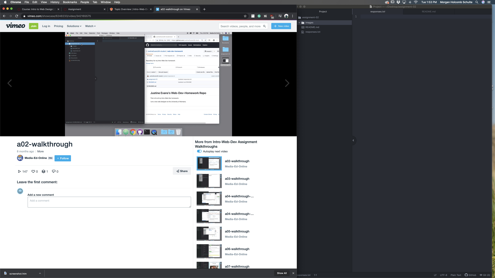

# Assignment-02
## Morgan Schulte

I decided to take this class because I believe that web development is going to be a core part of education soon. The world is moving quickly, and it is important that I build a foundation that lets me keep up. I am interested in the creative aspects of web design, graphic design, and other forms of media art. In order to express my creativity, I must first learn the tools necessary to make art.

A list of three things I hope to learn:
1. Coding for graphic design
2. Further understanding of basic coding languages
3. The ability to create a better flow for users

[Artsy](https://www.artsy.net/)

[My Response File](./responses.txt)

