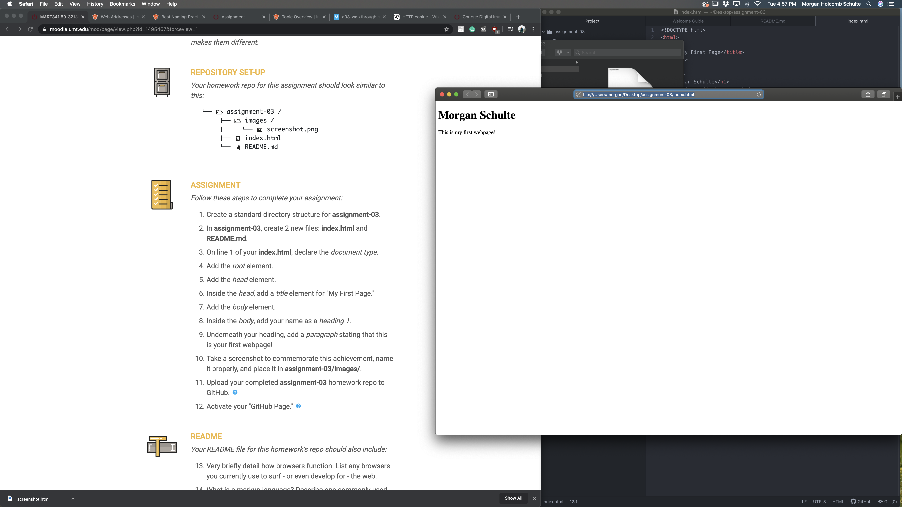

# Assignment-03
## Morgan Schulte

Browsers function by interpreting the data sent by a website. Each browser has a user interface that makes it easier for the user to navigate (search bar, tabs, etc.). The browser has a rendering engine to show data sent by HTML and CSS documents. The browser engine is what connects and directs action from the user interface to the rendering engine. Part of the browser is the network it uses to fetch all the information. If the information is in a different language, like Java Script, the browser will use interpretation software. There's data storage to make sure that there's information being saved as pages are switched or refreshed. All of these different parts are what makes each browser different. If the rendering engine is different, the websites will show up differently.

A markup language is a way of formatting a webpage. Instead of being able to write a webpage like a text document, a structure must be made through a markup language. Hypertext Markup Language, or HTML, is the most common markup language. HTML uses elements that begin and end with tags, letting browsers know where things are placed and with what purpose.

