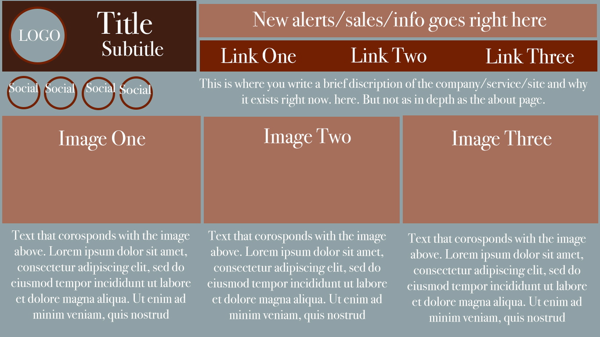

# Assignment-11
## Morgan Schulte

Borders are lines around the content. Padding goes in-between the content and the border. Margins are the space between different elements and content. A more physical example would be a framed photo. The photo is the content. The padding is the matte board, and the frame is the boarder. The margin would be the space between that framed photo and the next framed photo.

My work cycle for this assignment started with looking at different websites and figuring out what I liked and didn't like. I wanted to try having the navigation at the top, along with areas to display alerts. I kept seeing a lot of covid related information at the top of websites so I made space for something to go up at the top besides the navigation and logo. Most of my inspiration came from Madewell's website because they were having a sale and I got distracted there so I mostly stuck with what I saw there. I then went to adobe for color palette inspiration. The vast majority of sites I saw had white backgrounds, but I decided against that so I would be able to see where I was putting things. I then found out where to download social media icons. I then went into Photoshop to sketch out what I wanted. I think I got a little more complicated than I should have and ran into problems after, when I started coding. I did most of my HTML stuff first. I tried to remember to make room for each div in CSS right after I created it. I tried to stick to percentages for most things in CSS. I had a HUGE problem with my social media icons. I think it was due to float:left appearing strangely. I had to call several friends and all my coding friends just try out things until something works. I ended up finding the solution on my own. It had to do with sizing. I still don't understand totally why they weren't lining up but that's over now. I ended with minor adjustments and looked through the list of assignment requirements to make sure I had everything.
